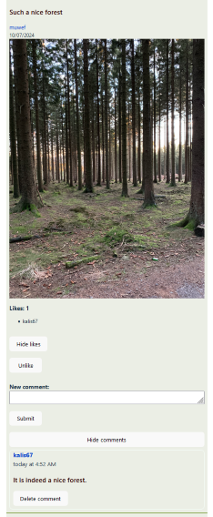

# Nahebook: a social media website

This project is build using a React frontend and backend using Express, NodeJS + MongoDB. User authentication is handled via a local strategy with Passport.js. JSON Web Tokens are used to protect routes within the application. Unauthorized users can only visit the homepage and the sign in/sign up pages.

## The Odin Project: Lesson Odin-Book

This project is build according to the specification of the [Odin-Book lesson](https://www.theodinproject.com/lessons/nodejs-odin-book).

## Live website

Users can sign up to create new posts and follow other users. To take a quick look there is the ability to sign as a guest.

Access the [Nahebook](https://nahebook-odin-frontend.netlify.app/)

## Run locally

*In order to run project locally NodeJS + Git needs to installed on your system*

Follow these steps on Mac/Linux/WSL to run the project locally:

1. Open a terminal and go to a directory you want the repository to be in
2. Select Code in the Github project page and copy the SSH URL
3. git clone *SSH URL*
4. 'cd' into the repository you just cloned
5. 'cd' into nahebook-backend & run 'npm install'
6. Run 'npm run serverStart' in nahebook-backend directory
7. Open another terminal
8. 'cd' into nahebook-frontend & run 'npm install'
9. Run 'npm run dev' in nahebook-frontend
10. Open the link that is shown in the terminal in your browser
